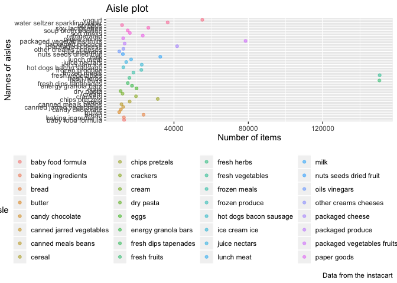
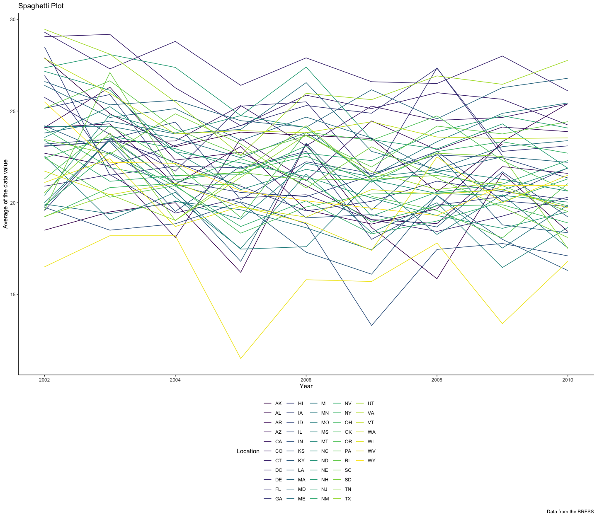
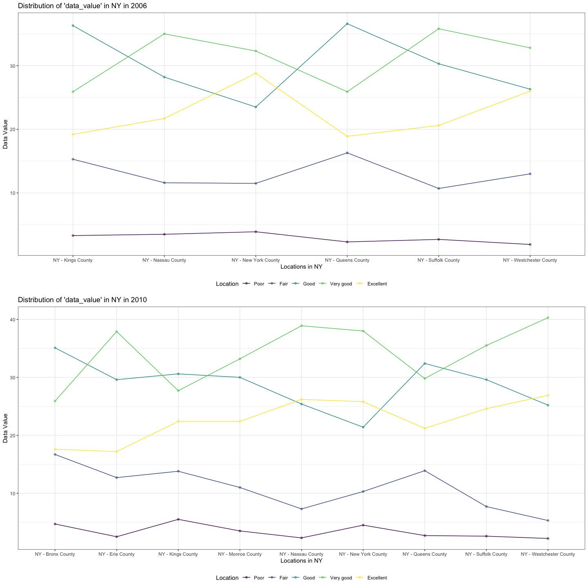
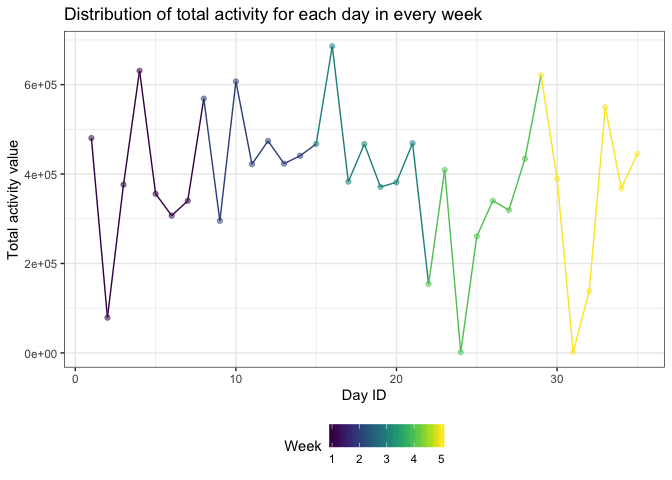
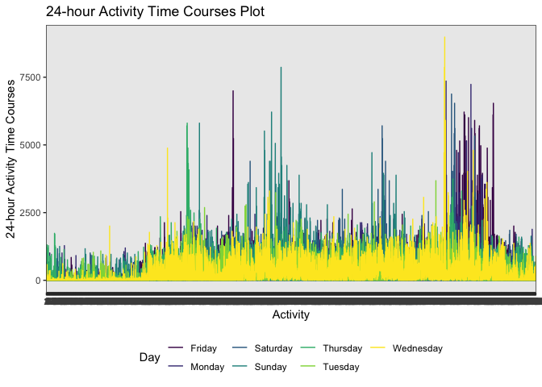

p8105\_hw3\_yw3438
================
Yuning Wang
10/3/2019

## Problem 1

``` r
# Read the data
library(p8105.datasets)
data("instacart")
```

The dataset in problem 1 is ‘instacart’ with a size of “1384617 \* 15”.
The type of the dataset is “list”. Some of the key varialbes in the data
include “order\_dow” whose observations represent the day of the week on
which the order was placed, “product\_name” whose observations show the
names of the products, “aisle\_id” whose observations are aisle
identifier, and “aisle” whose observations are the names of the aisles.

``` r
# group by aisle and find out the rank of them
aisles_from = instacart %>% 
  group_by(aisle) %>% 
  summarize(n_aisle = n()) %>% 
  arrange(desc(n_aisle))
# Find out how many aisles are there
n_aisles = nrow(aisles_from)
```

1)  It can be discovered that there are 134 aisles in the data and the
    most items are ordered from fresh vegetables. The result shows that
    people are holding healthy diet and are concerned about having
    enough vegetalbes because fresh vegetables are the aisle that most
    items are ordered from.

<!-- end list -->

``` r
# Draw the plot of aisles
aisles_from %>% 
  filter(n_aisle > 10000) %>% 
  ggplot(aes(x = reorder(aisle, n_aisle), y = n_aisle, fill = aisle)) +
  geom_col() + 
  labs(
    title = "Aisle plot",
    x = "Number of items",
    y = "Names of aisles",
    caption = "Data from the instacart") +
  theme_bw() +
  theme(legend.position = "bottom",
        axis.text.x = element_text(angle = 90, hjust = 1)) +
  viridis::scale_color_viridis(
    name = "Aisle",
    discrete = TRUE
  )
```

<!-- -->

2)  It can be discovered from the plot that with number of aisles
    getting higher, the kind of food is getting healthier with lower
    calories and more related to cooking. This plot can be used to find
    out the kind of food that people are most tend to buy online and
    combine them together to stimulate profits.

<!-- end list -->

``` r
# Find out the 3 most popular items in certain aisles
three_pop_data = instacart %>% 
  filter(aisle %in% 
           c("baking ingredients", "dog food care", "packaged vegetables fruits")
         ) %>% 
  group_by(aisle, product_name) %>% 
  summarize(n_product_name = n()) %>% 
  group_by(aisle) %>% 
  filter(min_rank(desc(n_product_name)) < 4) %>% 
  arrange(aisle)

# Create a readable table
knitr::kable(three_pop_data)
```

| aisle                      | product\_name                                 | n\_product\_name |
| :------------------------- | :-------------------------------------------- | ---------------: |
| baking ingredients         | Cane Sugar                                    |              336 |
| baking ingredients         | Light Brown Sugar                             |              499 |
| baking ingredients         | Pure Baking Soda                              |              387 |
| dog food care              | Organix Chicken & Brown Rice Recipe           |               28 |
| dog food care              | Small Dog Biscuits                            |               26 |
| dog food care              | Snack Sticks Chicken & Rice Recipe Dog Treats |               30 |
| packaged vegetables fruits | Organic Baby Spinach                          |             9784 |
| packaged vegetables fruits | Organic Blueberries                           |             4966 |
| packaged vegetables fruits | Organic Raspberries                           |             5546 |

3)  The table is a 9 \* 3 containing 9 rows and 3 columns. The main
    varialbes in the data include “aisle” showing the name of the asile,
    “product\_name” showing the specific name of the three most popular
    items in the aisle and “n\_product\_name” showing the number of
    times each item is ordered. From the table, it can be discovered
    that packaged vegetables fruits are ordered much more than baking
    ingredients and dog food care. Organic foods are welcomed by
    customers.

<!-- end list -->

``` r
# Find the mean hour of the day which PLA & CIC are ordered on each day of week
pla_cic_data = instacart %>% 
  filter(product_name %in% c("Pink Lady Apple", "Coffee Ice Cream")) %>% 
  group_by(product_name, order_dow) %>% 
  summarize(
    mean_order_of_day = mean(order_hour_of_day)
  ) %>% 
  mutate(order_dow = recode(order_dow, 
    "0" = "Sunday", "1" = "Monday", "2" = "Tuesday", "3" = "Wednesday",
    "4" = "Thursday", "5" = "Friday", "6" = "Saturday")) %>% 
  pivot_wider(
    names_from = "order_dow",
    values_from = "mean_order_of_day"
  )
# Make a readable table
knitr::kable(pla_cic_data, digits = 2)
```

| product\_name    | Sunday | Monday | Tuesday | Wednesday | Thursday | Friday | Saturday |
| :--------------- | -----: | -----: | ------: | --------: | -------: | -----: | -------: |
| Coffee Ice Cream |  13.77 |  14.32 |   15.38 |     15.32 |    15.22 |  12.26 |    13.83 |
| Pink Lady Apple  |  14.40 |  14.20 |   13.20 |      8.00 |    11.00 |  16.00 |    13.00 |

4)  The table is a 2 \* 8 containing 2 rows and 8 columns. The key
    variables included in the table are “product\_name” that describes
    the product names, “Sunday”, “Monday”, “Tuesday”, “Wednesday”,
    “Thursday”, “Friday” and “Saturday”, which contain the mean order
    of the two products of that specific day. This table shows the
    orders of the two products on each day of the week, which is helpful
    for sellers to improve profits by choosing proper time to make
    discounts.

## Problem 2

``` r
library(p8105.datasets)
data("brfss_smart2010")
```

read and clean the dataset

``` r
brfss_smart2010 = brfss_smart2010 %>% 
  janitor::clean_names() %>% 
  filter(topic == "Overall Health") %>% 
  mutate(response = factor(response,
                  levels = c("Poor", "Fair",
                             "Good", "Very good","Excellent"),
                  ordered = is.ordered(response)
                  ))%>% 
  drop_na(response) %>%
  rename(state_name_abb = locationabbr) %>% 
  arrange(response)
```

1)  To find out states at 7 or more locations in 2002, we firstly make a
    dataset include the states that were observed at 7 or more locations
    in 2002.

<!-- end list -->

``` r
# Create a dataset about the requirements in 2002
state_2002 = brfss_smart2010 %>% 
  filter(year == 2002) %>% 
  group_by(state_name_abb) %>% 
  summarize(n_state = n()) %>% 
  filter(n_state >= 7) 
```

In 2002, the abbreviation of the states that were observed at 7 or more
locations were AZ, CO, CT, DE, FL, GA, HI, ID, IL, IN, KS, LA, MA, MD,
ME, MI, MN, MO, NC, NE, NH, NJ, NV, NY, OH, OK, OR, PA, RI, SC, SD, TN,
TX, UT, VT, WA.

This shows the situation of topic “Overall Health” and its distribution
in 2002.

To find out states at 7 or more locations in 2010, we firstly make a
dataset include the states that were observed at 7 or more locations in
2010.

``` r
# Create a dataset about the requirements in 2010
state_2010 = brfss_smart2010 %>% 
  filter(year == 2010) %>% 
  group_by(state_name_abb) %>% 
  summarize(n_state = n()) %>% 
  filter(n_state >= 7)
```

In 2010, the abbreviation of the states that were observed at 7 or more
locations were AL, AR, AZ, CA, CO, CT, DE, FL, GA, HI, IA, ID, IL, IN,
KS, LA, MA, MD, ME, MI, MN, MO, MS, MT, NC, ND, NE, NH, NJ, NM, NV, NY,
OH, OK, OR, PA, RI, SC, SD, TN, TX, UT, VT, WA, WY.

This shows the situation of topic “Overall Health” and its distribution
in 2010.

2)  To draw the plot of the average value of “Excellent” response over
    time within a state, we firstly need to create a dataset limited to
    “Excellent” response.

<!-- end list -->

``` r
# Create a dataset contains response of only "Excellent".
excellent_form = brfss_smart2010 %>% 
  filter(response == "Excellent") %>% 
  group_by(state_name_abb, year) %>% 
  summarize(ave_data_value = mean(data_value))
```

Secondly, we need to use the dataset to make a “spaghetti” plot of the
average value over time within a state

``` r
# Draw the plot
ave_plot = excellent_form %>% 
  ggplot(aes(x = year, y = ave_data_value, , color = state_name_abb)) +
  geom_line() +
  labs(
    title = "Spaghetti Plot",
    x = "Year",
    y = "Average of the data value",
    caption = "Data from the BRFSS"
  ) + 
  theme_classic() +
  theme(legend.position = "bottom") +
  viridis::scale_color_viridis(
    name = "Location", 
    discrete = TRUE
  )
ave_plot
```

    ## Warning: Removed 3 rows containing missing values (geom_path).

<!-- -->

This is a line plot that shows the the average value over time within
states whose response is “Excellent”. The x-axis represents the “year”
and the y-axis show the value of the mean of data value. The lines here
represent the change in average of data value in specific states from
2002 to 2010.

The line plot directly shows the trends of the mean of data value in
each states over the period because of clear lines. Considering the
large amount of data we have in this dataset, compared with lots of
points that may cause confusion, line plot is a better choice to show
the trends.

3)  To make a two-panel plot showing the distribution of “data\_value”
    for responses of years 2006 and 2010, we need to draw the plots of
    2006 and 2010 firstly and then patchwork them.

<!-- end list -->

``` r
#Draw the plot of 2006 and 2010
brfss_smart2010 %>% 
  filter(year %in% c("2006", "2010"), state_name_abb == "NY") %>% 
  select(data_value, response, locationdesc, year) %>% 
  ggplot(aes(x = response, y = data_value, 
             group = locationdesc, color = locationdesc)) +
  geom_point(alpha = .5) +
  geom_line() +
  theme_bw() +
  theme(legend.position = "bottom") +
  labs(
    x = "Response",
    y = "Data Value",
    title = "Distribution of 'data_value' in NY in 2006 and 2010"
  ) +
  viridis::scale_color_viridis(
    name = "Location", 
    discrete = TRUE
  ) +
  facet_grid(~year)
```

<!-- -->

The two-panel plot shows the distribution of “data\_value” for responses
among locations in NY State of years 2006 and 2010, with y-axis
representing data value and x-axis showing the response. The line plot
with value points shows the specific data value and the differences in
different locations in 2006 and 2010. The plot can represent the general
health conditions of people in specific districts and the difference of
health conditions between poeple from different districts in 2006 and
2010.

## Problem 3

``` r
accel_data = read_csv("./accel_data.csv") %>% 
  mutate(
    weekday_weekend = case_when(day == "Monday" ~ "weekday",
                             day == "Tuesday" ~ "weekday",
                             day == "Wednesday" ~ "weekday", 
                             day == "Thursday" ~ "weekday", 
                             day == "Friday" ~ "weekday",
                             day == "Saturday" ~ "weekend",
                             day == "Sunday"~ "weekend"),
    week = as.integer(week),
    day_id = as.integer(day_id)) %>%
  select(1:3, weekday_weekend, everything())
```

After reading and cleaning the data, it can be discovered that the new
dataset ‘accel\_data’ has 1444 variables and 35 observations. The
variable class of all ‘activity.n’ variables is numeric. The class of
variable ‘day’ and ‘weekday\_weekend’ is character while the class of
variable ‘week’ and ‘day\_id’ is integer.

``` r
# Create a dataset containing the total activity variable for each day
total_accel_data = accel_data %>% 
  mutate(
    total = rowSums(accel_data[,5:1444], na.rm = FALSE)
    ) %>% 
  select(1:4, total) %>% 
  group_by(week) %>% 
  arrange(week, total)
# Show in table
knitr::kable(total_accel_data)
```

| week | day\_id | day       | weekday\_weekend |     total |
| ---: | ------: | :-------- | :--------------- | --------: |
|    1 |       2 | Monday    | weekday          |  78828.07 |
|    1 |       6 | Tuesday   | weekday          | 307094.24 |
|    1 |       7 | Wednesday | weekday          | 340115.01 |
|    1 |       5 | Thursday  | weekday          | 355923.64 |
|    1 |       3 | Saturday  | weekend          | 376254.00 |
|    1 |       1 | Friday    | weekday          | 480542.62 |
|    1 |       4 | Sunday    | weekend          | 631105.00 |
|    2 |       9 | Monday    | weekday          | 295431.00 |
|    2 |      11 | Sunday    | weekend          | 422018.00 |
|    2 |      13 | Tuesday   | weekday          | 423245.00 |
|    2 |      14 | Wednesday | weekday          | 440962.00 |
|    2 |      12 | Thursday  | weekday          | 474048.00 |
|    2 |       8 | Friday    | weekday          | 568839.00 |
|    2 |      10 | Saturday  | weekend          | 607175.00 |
|    3 |      19 | Thursday  | weekday          | 371230.00 |
|    3 |      20 | Tuesday   | weekday          | 381507.00 |
|    3 |      17 | Saturday  | weekend          | 382928.00 |
|    3 |      18 | Sunday    | weekend          | 467052.00 |
|    3 |      15 | Friday    | weekday          | 467420.00 |
|    3 |      21 | Wednesday | weekday          | 468869.00 |
|    3 |      16 | Monday    | weekday          | 685910.00 |
|    4 |      24 | Saturday  | weekend          |   1440.00 |
|    4 |      22 | Friday    | weekday          | 154049.00 |
|    4 |      25 | Sunday    | weekend          | 260617.00 |
|    4 |      27 | Tuesday   | weekday          | 319568.00 |
|    4 |      26 | Thursday  | weekday          | 340291.00 |
|    4 |      23 | Monday    | weekday          | 409450.00 |
|    4 |      28 | Wednesday | weekday          | 434460.00 |
|    5 |      31 | Saturday  | weekend          |   1440.00 |
|    5 |      32 | Sunday    | weekend          | 138421.00 |
|    5 |      34 | Tuesday   | weekday          | 367824.00 |
|    5 |      30 | Monday    | weekday          | 389080.00 |
|    5 |      35 | Wednesday | weekday          | 445366.00 |
|    5 |      33 | Thursday  | weekday          | 549658.00 |
|    5 |      29 | Friday    | weekday          | 620860.00 |

``` r
# Create a plot to figure out any trends in the table
total_accel_data %>% 
  ggplot(aes(x = day_id, y = total,
             color = week)) +
  geom_point(alpha = .5) +
  geom_line() +
  theme_bw() +
  theme(legend.position = "bottom") +
  labs(
    x = "Day ID",
    y = "Total activity value",
    title = "Distribution of total activity for each day in every week"
  ) +
  viridis::scale_color_viridis(
    name = "Week", 
    discrete = FALSE
  )
```

<!-- -->

The table showing above can reflect the total activity for each day. In
this table, the total value is ranked from low to high in each week.
From the plot, it can be discovered that in the first weeks, the total
activity is lower on the beginning of the week, like Monday. In the last
two week, the total activity is quite low on Saturday. From the plot
showing the distribution of total activity for each day, it can be
discovered that there were great changes in the total value and it
varied greatly during each week.

The single-panel plot of the 24-hour activity time courses for each day
is like:

``` r
accel_data %>% 
  pivot_longer(
    activity.1:activity.1440,
    names_to = "activity",
    values_to = "act_data"
    ) %>% 
  ggplot(aes(x = activity, y = act_data, 
             group = day, color = day)) +
  geom_line() +
  theme_bw() +
  theme(legend.position = "bottom") +
  labs(
    x = "Week",
    y = "24-hour Activity Time Courses",
    title = "24-hour Activity Time Courses Plot"
  ) +
  viridis::scale_color_viridis(
    name = "Day", 
    discrete = TRUE
  )
```

<!-- -->

From the plot , it can be discovered that the 24-hour activity time
courses were generally small on Saturday and Monday, while that value of
Friday was high on Friday.
