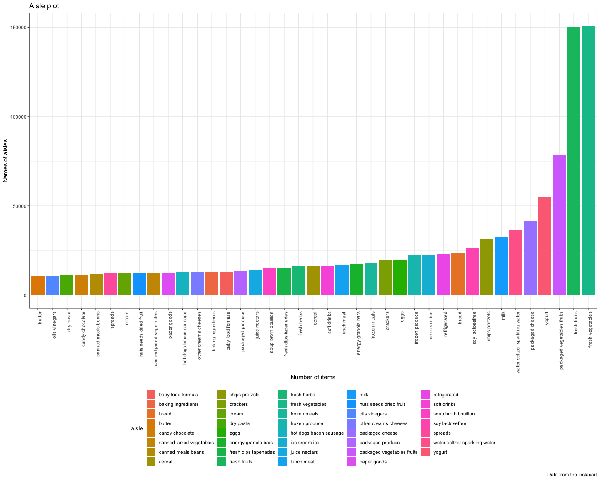

p8105\_hw3\_yw3438
================
Yuning Wang
10/3/2019

## Problem 1

``` r
# Read the data
library(p8105.datasets)
data("instacart")
```

**To find out the number of aisles and which aisle is the most items
ordered from.**

``` r
aisles_from = instacart %>% 
  group_by(aisle) %>% 
  summarize(n_aisle = n()) %>% 
  arrange(desc(n_aisle))
#Find out how many aisles are there
n_aisles = nrow(aisles_from)
```

It can be concluded that the number of aisles is 134 and the most items
are ordered from fresh vegetables

**To draw the plot showing the number of items ordered in each aisle**

``` r
aisles_from %>% 
  filter(n_aisle > 10000) %>% 
  ggplot(aes(x = reorder(aisle, n_aisle), y = n_aisle, fill = aisle)) +
  geom_col() + 
  labs(
    title = "Aisle plot",
    x = "Number of items",
    y = "Names of aisles",
    caption = "Data from the instacart") +
  theme_bw() +
  theme(legend.position = "bottom",
        axis.text.x = element_text(angle = 90, hjust = 1)) +
  viridis::scale_color_viridis(
    name = "Aisle",
    discrete = TRUE
  )
```

<!-- -->

**To make a table showing the three most popular items in specific
aisles**

``` r
instacart %>% 
  filter(aisle %in% 
           c("baking ingredients", "dog food care", "packaged vegetables fruits")
         ) %>% 
  group_by(aisle, product_name) %>% 
  summarize(n_product_name = n()) %>% 
  group_by(aisle) %>% 
  filter(min_rank(desc(n_product_name)) < 4) %>% 
  arrange(aisle) %>%
  knitr::kable()
```

| aisle                      | product\_name                                 | n\_product\_name |
| :------------------------- | :-------------------------------------------- | ---------------: |
| baking ingredients         | Cane Sugar                                    |              336 |
| baking ingredients         | Light Brown Sugar                             |              499 |
| baking ingredients         | Pure Baking Soda                              |              387 |
| dog food care              | Organix Chicken & Brown Rice Recipe           |               28 |
| dog food care              | Small Dog Biscuits                            |               26 |
| dog food care              | Snack Sticks Chicken & Rice Recipe Dog Treats |               30 |
| packaged vegetables fruits | Organic Baby Spinach                          |             9784 |
| packaged vegetables fruits | Organic Blueberries                           |             4966 |
| packaged vegetables fruits | Organic Raspberries                           |             5546 |

**To make a table about PLA and CIC**

``` r
instacart %>% 
  filter(product_name %in% c("Pink Lady Apple", "Coffee Ice Cream")) %>% 
  group_by(product_name, order_dow) %>% 
  summarize(
    mean_order_of_day = mean(order_hour_of_day)
  ) %>% 
  mutate(order_dow = recode(order_dow, 
    "0" = "Sunday", "1" = "Monday", "2" = "Tuesday", "3" = "Wednesday",
    "4" = "Thursday", "5" = "Friday", "6" = "Saturday")) %>% 
  pivot_wider(
    names_from = "order_dow",
    values_from = "mean_order_of_day"
  ) %>% 
  knitr::kable(digits = 2)
```

| product\_name    | Sunday | Monday | Tuesday | Wednesday | Thursday | Friday | Saturday |
| :--------------- | -----: | -----: | ------: | --------: | -------: | -----: | -------: |
| Coffee Ice Cream |  13.77 |  14.32 |   15.38 |     15.32 |    15.22 |  12.26 |    13.83 |
| Pink Lady Apple  |  14.40 |  14.20 |   13.20 |      8.00 |    11.00 |  16.00 |    13.00 |

## Problem 2

``` r
library(p8105.datasets)
data("brfss_smart2010")
```

read and clean the dataset

``` r
brfss_smart2010 = brfss_smart2010 %>% 
  janitor::clean_names() %>% 
  filter(topic == "Overall Health") %>% 
  mutate(response = 
           factor(response,
                  levels = c("Poor", "Fair",
                             "Good", "Very good","Excellent"),
                  ordered = is.ordered(response)
                  ))%>% 
  drop_na(response) %>%
  rename(state_name_abb = locationabbr) %>% 
  arrange(response)
```

1)To find out states at 7 or more locations in 2002

``` r
state_2002 = brfss_smart2010 %>% 
  filter(year == 2002) %>% 
  group_by(state_name_abb) %>% 
  summarize(n_state = n()) %>% 
  filter(n_state >= 7) 
```

In 2002, the abbreviation of the states that were observed at 7 or more
locations were AZ, CO, CT, DE, FL, GA, HI, ID, IL, IN, KS, LA, MA, MD,
ME, MI, MN, MO, NC, NE, NH, NJ, NV, NY, OH, OK, OR, PA, RI, SC, SD, TN,
TX, UT, VT, WA.

2)To find out states at 7 or more locations in 2010

``` r
state_2010 = brfss_smart2010 %>% 
  filter(year == 2010) %>% 
  group_by(state_name_abb) %>% 
  summarize(n_state = n()) %>% 
  filter(n_state >= 7)
```

In 2010, the abbreviation of the states that were observed at 7 or more
locations were AL, AR, AZ, CA, CO, CT, DE, FL, GA, HI, IA, ID, IL, IN,
KS, LA, MA, MD, ME, MI, MN, MO, MS, MT, NC, ND, NE, NH, NJ, NM, NV, NY,
OH, OK, OR, PA, RI, SC, SD, TN, TX, UT, VT, WA, WY.

3)  To construct the dataset

<!-- end list -->

``` r
excellent_form = brfss_smart2010 %>% 
  filter(response == "Excellent") %>% 
  group_by(state_name_abb, year) %>% 
  summarize(ave_data_value = mean(data_value))
```

To make a “spaghetti” plot of the average value over time within a state

``` r
ave_plot = excellent_form %>% 
  ggplot(aes(x = year, y = ave_data_value, , color = state_name_abb)) +
  geom_line() +
  labs(
    title = "Spaghetti Plot",
    x = "Year",
    y = "Average of the data value",
    caption = "Data from the BRFSS"
  ) + 
  theme_classic() +
  theme(legend.position = "bottom") +
  viridis::scale_color_viridis(
    name = "Location", 
    discrete = TRUE
  )
ave_plot
```

    ## Warning: Removed 3 rows containing missing values (geom_path).

<!-- -->

4)  
<!-- end list -->

``` r
#Draw the plot of 2006
data_value_06 = brfss_smart2010 %>% 
  filter(year == "2006" & state_name_abb == "NY") %>% 
  select(data_value, response, locationdesc) %>% 
  ggplot(aes(x = locationdesc, y = data_value, 
             group = response, color = response)) +
  geom_point(alpha = .5) +
  geom_line() +
  theme_bw() +
  theme(legend.position = "bottom") +
  labs(
    x = "Locations in NY",
    y = "Data Value",
    title = "Distribution of 'data_value' in NY in 2006"
  ) +
  viridis::scale_color_viridis(
    name = "Location", 
    discrete = TRUE
  )


#Draw the plot of 2010
data_value_10 = brfss_smart2010 %>% 
  filter(year == "2010" & state_name_abb == "NY") %>% 
  select(data_value, response, locationdesc) %>% 
  ggplot(aes(x = locationdesc, y = data_value, 
             group = response, color = response)) +
  geom_point(alpha = .5) +
  geom_line() +
  theme_bw() +
  theme(legend.position = "bottom") +
  labs(
    x = "Locations in NY",
    y = "Data Value",
    title = "Distribution of 'data_value' in NY in 2010"
  ) +
  viridis::scale_color_viridis(
    name = "Location", 
    discrete = TRUE
  )

# Draw a two-panel plot
data_value_06 / data_value_10
```

<!-- -->

## Problem 3

``` r
accel_data = read_csv("./accel_data.csv") %>% 
  mutate(
    weekday_weekend = case_when(day == "Monday" ~ "weekday",
                             day == "Tuesday" ~ "weekday",
                             day == "Wednesday" ~ "weekday", 
                             day == "Thursday" ~ "weekday", 
                             day == "Friday" ~ "weekday",
                             day == "Saturday" ~ "weekend",
                             day == "Sunday"~ "weekend"),
    week = as.integer(week),
    day_id = as.integer(day_id)) %>% 
  select(1:3, weekday_weekend, everything())
```

    ## Parsed with column specification:
    ## cols(
    ##   .default = col_double(),
    ##   day = col_character()
    ## )

    ## See spec(...) for full column specifications.

After reading and cleaning the data, it can be discovered that the new
dataset ‘accel\_data’ has 1444 variables and 35 observations. The
variable class of columns 5 to the end is numeric. The class of variable
‘day’ and ‘weekday\_weekend’ is character while the class of variable
‘week’ and ‘day\_id’ is integer.
